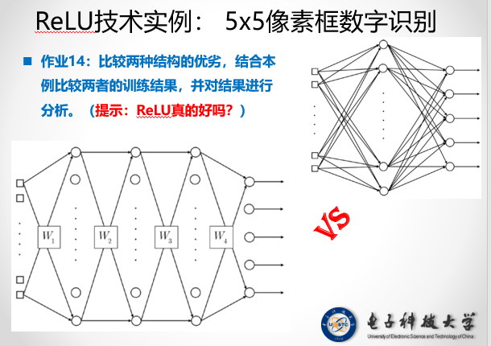

# UESTC_DeepLearning-EXP
So Crazy So Funny.......

---
Test1 

作业1：用SGD、批量和小批量算法，训练网络，给出最终权值系数和四个样本的网络输出值【其中，SGD训练1000轮，批量训练4000轮,小批量（2个样本为一组）训练2000轮】

作业2：结合作业1，比较SGD、批量与小批量三种算法的**学习速度**。  
说明：每种算法学习1000轮，画出“轮-误差”曲线，其中误差=4个实际输出与期望数输出之差的平方和

作业3：用SGD对数据2练4000轮，给出最终权值系数与4个样本的网络输出，验证训练结果是否有效

训练数据
$$
训练数据=\begin{Bmatrix}
{0}&{0}&{1}&{0}\\
{0}&{1}&{1}&{1}\\
{1}&{0}&{1}&{1}\\
{1}&{1}&{1}&{0}
\end{Bmatrix}
$$

---
Test2

作业4：训练浅层NN解决XOR问题

作业5： 尝试改变隐层节点个数（3、5、2？）观察能否解决XOR为？如何避免不收敛

---
Test3

作业7：分别用交叉熵和误差平方和代价函数训练同一神经网络解决XOR问题比较误差-轮次曲线。

训练数据
$$
训练数据=\begin{Bmatrix}
{0}&{0}&{1}&{0}\\
{0}&{1}&{1}&{1}\\
{1}&{0}&{1}&{1}\\
{1}&{1}&{1}&{0} 
\end{Bmatrix}
$$

(隐层与输出层激活函数均采用sigmoid，权值初始值相同)

作业8：
1.  试用梯度下降算法推到交叉熵代价函数下的BP学习规则
2.  试用梯度下降算法推导带正则化项的BP学习规则
---
Test4

作业9：用所学实现本案例
`onehot`编码

设计和训练神经网络识别以下五个数字：

---
Test5

作业10：用训练数据训练神经网络，用测试数据测试训练结果（注：运行多次观察结果是否变化， 如有变化思考原因） 

作业11：尝试构造其他测试数据测试网络

---
Test6

作业12：补全代码，观察训练结果是否有效

代码如下图所示
CODE-1  

CODE-2  

CODE-3  

CODE-4  

 
作业13：重复运行多次主函数，观察训练结果是否有差异？思考其中原因与改善方法

训练数据依旧使用下图

---
Test7

作业14：比较分析两种结构的优劣，结合本例子比较两者的训练结果，并对结合进行分析（ReLu真的好吗？）

作业15：补全Dropout 相关代码实现，得到训练结果

作业16:利用Dropout+ReLu实现 $5\times5像素框数字识别$  
测试样例仍采用

---
Practice

基于[MINST数据库](Resource/readme.txt),设计与训练CNN，识别手写体数字

设计要求
1. 应该用尽量简单的结构，获得最优的性能（识别率>97%）
2. 在不增加总的可调整权值系数的前提下，可对网络结构做出优化（如：加深Hidden层层数)
3. 要求
 $$
 权值系数\leq (9\times9\times20+2000\times100+100\times10)
 $$  
 4. 可以采用SGD、批量、小批量、动量等算法
 5. 编程语言不限，但是必须有**具体的训练步骤**（每层$\delta$的计算代码）**禁止使用现有的CNN框架**（~~自己造轮子~~）
